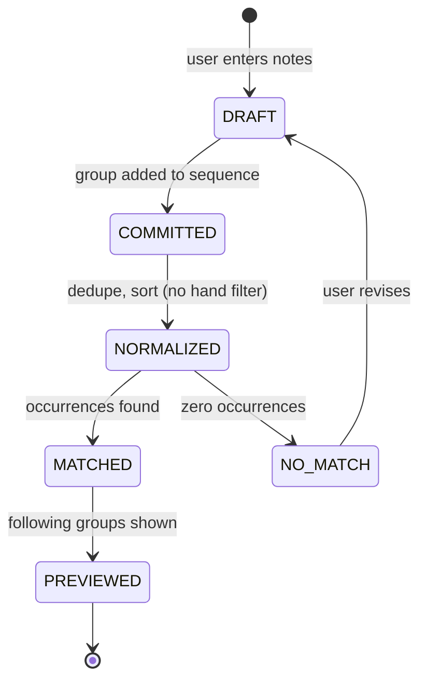
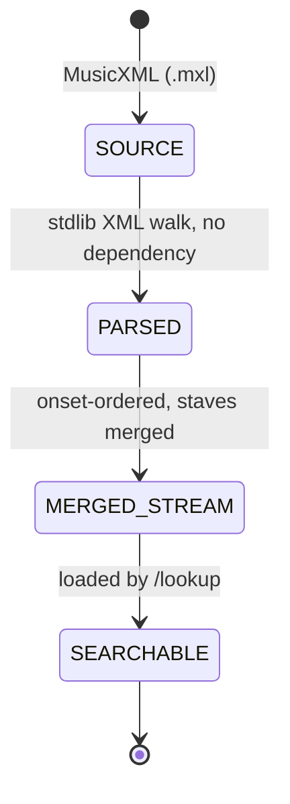
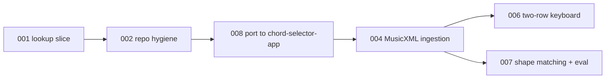

# Chordsense Product Loop Map

Status date: 2026-08-02 (Loop 008 accepted)
Depth: light and directional. This file is the navigational index. Deep, executable definitions live in `docs/planning/loops/`.

## Repository

**Home: `whoisbe/chord-selector-app`, branch `phrase-lookup`.** Vite 6 + React 18 + Radix + Tailwind + vitest. **This repo is now canonical** — these docs live here as of Loop 008.

Loops 001 and 002 were executed in `whoisbe/chordsense` — a different application (Next.js 15 App Router, MDX blog), cloned by mistake. Nothing was ever pushed there. Loop 008 ports the framework-independent work across; `chordsense` keeps its own life as a blog project.

The port cost almost nothing, for one reason: Loop 001's invariant that **search code has no React, DOM, network, or filesystem dependency** meant a whole framework change left the core logic untouched. The ADRs cost nothing either — they are facts about music data, not about a repo.

Loop IDs are assigned in creation order, not execution order. Execution order is the table below.

## Product frame

Chordsense answers one question: **"I'm at the piano, I remember this fragment, what comes next?"**

The user has a phrase in their hands or their head. They enter it. Chordsense finds every place that phrase occurs in a piece and shows what follows.

This is a reverse index over score data, not a practice app, notation editor, or playback engine.

## Two core objects, two lifecycles

The project has two objects with independent lifecycles. Loop 001 proved the first one against a fixture — and first contact with a real score then overturned part of it.

### Object A: Phrase query



Loop 001's transition: `DRAFT -> PREVIEWED` against a hand-authored fixture. Exact, ordered, register-sensitive, single-hand.

The `hand filter` step is struck through by ADR 0002. Input now arrives from two keyboard rows but produces one group per onset — see Loop 006.

### Object B: Piece

Both `UNKNOWN` nodes are now resolved — see ADR 0001.



The stream shape is the contract between the two objects. **Loop 001's version was wrong and is superseded by ADR 0002**, which replaced the staff-split, single-hand-filtered stream with a merged onset stream:

```ts
type NoteGroup = { measure: number; tick: number; notes: number[]; staves: number[] }
```

Staff survives as display metadata. It is not a search filter and is not called "hand." Store integer ticks, derive beats for display — triplets against `divisions=12` produce 1.33/1.67, and float beats invite equality bugs.

## Chunk sequence



| Loop | Type | Status | Gated on |
|---|---|---|---|
| [001 phrase lookup search vertical slice](loops/001-phrase-lookup-search-vertical-slice.md) | Completion | **DONE** | — |
| [002 repo hygiene and first commit](loops/002-repo-hygiene-and-first-commit.md) | Governance | **DONE** | — |
| ~~003 score data source decision~~ | Architecture-conformance | **superseded** — spike run inline, see ADR 0001 | — |
| [008 port to chord-selector-app](loops/008-port-to-chord-selector-app.md) | Completion | **DONE** | — |
| [004 MusicXML ingestion](loops/004-musicxml-ingestion.md) | Completion | **DONE** (accepted; defect found in review → 009) | — |
| [009 staff/pitch pairing repair](loops/009-staff-pairing-repair.md) | Repair | **DONE** | — |
| [010 adopt TypeScript typechecking](loops/010-typescript-typechecking.md) | Governance | **DONE** — all 15 checks pass | — |
| ~~005 Tailwind v3→v4 repair~~ | Repair | **dead** — defect was chordsense-only | — |
| [006 two-row virtual keyboard input](loops/006-two-row-keyboard-input.md) | Completion | **DONE** — all 16 checks pass | — |
| [011 group-wise key constraint](loops/011-group-wise-highlighting.md) | Completion | **DONE** | — |
| [012 single-row input](loops/012-single-row-input.md) | Completion | **DONE** | — |
| [013 Playwright e2e harness](loops/013-playwright-e2e.md) | Governance | **DONE** — 11 e2e tests, check 7 withdrawn as a spec error | — |
| [014 results as onset strips](loops/014-onset-strips.md) | Completion | **DONE** — all 19 checks, 0 repairs | — |
| [015 stack the following onsets](loops/015-stacked-following.md) | Completion | **DONE** — "then" rows stacked | — |
| [016 focused occurrence + measure navigation](loops/016-measure-navigation.md) | Completion | **DONE** — all 21 checks, 0 repairs | — |
| [017 browse the piece](loops/017-browse-the-piece.md) | Completion | **DONE** — all 21 checks, 1 repair | — |
| [018 prove ingestion generalises](../sprints/output/018-ingestion-generalises-output.md) | Eval | **DONE** — run inline, 6 findings | — |
| [019 read a score at runtime](loops/019-read-a-score-at-runtime.md) | Enabling | **DONE** — all 23 checks, 0 repairs | 018 |
| 020 upload a score | Completion | **NEXT — spec ready to write** | 019 |
| 007 shape matching and eval harness | Eval | directional | 004 |

### 001 phrase lookup search vertical slice — DONE

Executor: Codex. Evidence: `docs/sprints/output/phrase-lookup-search-vertical-slice-output.md`.

Codex passed every automated verifier and stranded at `BLOCKED` on one item: the prescribed `/lookup` browser interaction check, which its session had no browser backend to run. That was an executor-environment gap, not an implementation failure.

The macro layer closed it on 2026-08-01 against a human-hosted dev server: all six prescribed interaction steps passed, plus the empty-query message, no-results message, home-page link, and full C4–B5 button range. `npm test` and the search semantics were re-verified independently rather than accepted from the executor's self-report — including a fresh probe outside the loop's own test suite, which confirmed register sensitivity, exact group equality, real distractors in the fixture, and hand discrimination.

Two defects were found and deliberately **not** repaired, because both sit outside this loop's allowed paths:

- The ordered-query list renders doubled numbering, run together. Cosmetic; no acceptance criterion fails. Loop 005 replaces this input surface anyway, so the fix rides along there.
- **Tailwind utility classes are not applying anywhere in the app.** Verified on `/lookup` and on `/`, which predates Loop 001 — so this is a pre-existing repo condition, not something the slice introduced. Base styles from `globals.css` do apply. Currently unowned; see Open Decision 4.

### 002 repo hygiene and first commit — DONE

Loop 001 surfaced a defect it was forbidden from fixing. `.gitignore` line 21 carries `lib/` from a Python packaging template, so the entire Next.js `lib/` source tree is silently untracked, including all three `lib/music/` files Loop 001 was mandated to create. Verified with `git check-ignore -v`.

Nothing in the repo has been committed since Loop 001 ran. The slice exists only in the working tree.

The repo also still carried a Python-project identity: the root `README.md` documented a chord generator.

Executor: Codex. Terminal state `DONE`, zero repair attempts. Two commits: `71b2270` the Loop 001 slice, `4b273b3` the hygiene work.

Independently re-verified by the macro layer rather than accepted from the self-report: `lib/music/` is tracked and `git check-ignore` now exits 1 on it; `node_modules`, `.next`, and `.test-dist` remain ignored; `scripts/README.md` is byte-identical to the original root README, so it was moved rather than rewritten; `CLAUDE.md` and `AGENTS.md` are identical; `npm test` still 10/10. The defect was fixed at the rule, not papered over with `git add -f`.

### 003 score data source decision — SUPERSEDED

Specced as a three-way spike. Never run as a coding loop: the user supplied `data/spike/moonlight-sonata.mxl`, the macro layer parsed it inline, and one measurement collapsed the comparison — 1210 of 1210 notes carried an explicit `<staff>`, with zero heuristic inference. MIDI structurally cannot match that on the dimension that decides it. Recorded in **ADR 0001**.

Running the spike to confirm a foregone conclusion would have been ceremony. The spec file stays for the record, marked superseded.

### 004 MusicXML ingestion — DONE

Executor: Claude Code. Terminal state `DONE`, **zero repair attempts**, all 15 checks passing.

Macro-layer re-verification went further than re-reading: the committed artifact was compared event-for-event against an **independent parse of the same file** written separately by the macro layer. All **823 events matched on measure, tick, and pitch set — zero structural disagreements.** Every target number confirmed: 69 measures, 1169 pitched notes, 0 inferred staves, MIDI 29–87, 55 distinct pitches, 719+219=938 staff-split. Founding query returns exactly 1 match at m12 beat 4; the staff-split control returns 0 in each staff alone. The superseded hand test was properly replaced in-slot with a supersession comment, count still 10, the other nine untouched.

**A defect was found in review, in a facet no check covered** — see Loop 009. It does not invalidate this loop's evidence: the parse is correct, and the defect lives in how `copyGroup` carries the new `staves` array. Loop 004 is accepted; the repair is its own loop so this evidence record stays clean.

Also uncommitted at hand-back, because this loop's handoff omitted a commit task — a macro-layer omission, not an executor failure. Loop 009 commits it.

Retargeted after Loop 008. Target numbers and evidence unchanged; paths, tooling, and verifier revised against what `chord-selector-app` actually provides.

Two environment findings shaped it:

- **`npm run build` does not typecheck.** It is `vite build`, and esbuild strips types without checking them. `typescript` is not even a declared dependency. In chordsense, `next build` typechecked — that is exactly what caught Loop 001's ES5 spread bug. That safety net no longer exists, so assertions must live in vitest and a green build must not be read as type safety. Raised as a recommendation in the spec, deliberately not acted on, because adding `tsc` means adding a dependency.
- **XML and ZIP are solvable with what is already installed.** `jsdom ^27.1.0` is a declared devDependency and supplies `DOMParser`; Node has no built-in XML parser. The `.mxl` is extracted once with the `unzip` CLI and the plain XML committed, avoiding both a ZIP library and the transitive-only `fflate`. No new dependency.

Also new: check 14 requires the ingestion artifact to regenerate byte-identically, because a committed blob nobody can reproduce is a liability. And check 13 keeps jsdom out of the shipped bundle — it belongs to the build script only.

This is the loop where **ADR 0002 lands**: the single-hand filter is removed. Loop 008 ported it unchanged precisely so the removal shows up as this loop's diff.


Moves the real 69-measure movement from `.mxl` to the merged onset stream. The algorithm is already proven by the macro-layer spike, so the loop reimplements a known-good walk in TypeScript rather than discovering one, and the spike's numbers become the acceptance targets: 69 measures, 1169 pitched notes, 823 merged events, range F1–D#6.

Its decisive check is the founding query — `[F#3+F#4] → [C#4] → [E4]` must return exactly one match at measure 12 beat 4 — paired with a control proving each staff alone returns zero. A parser that gets the right answer for the wrong reason fails.

### 008 port to chord-selector-app — DONE

Executor: Claude Code. Terminal state `DONE`, zero repair attempts. Three commits on `phrase-lookup`, unpushed.

Macro-layer re-verification, run independently rather than read from the self-report: all three `lib/music` modules **byte-identical**; all **17 docs byte-identical**; the ten test cases present with names matching the source verbatim, in order; `src/lib/music/` free of React/DOM/`node:`; `package.json` and `package-lock.json` untouched; chordsense still `ahead 2` on the same two commits. Browser checks 11 and 12 closed by the macro layer through Chrome: the Phrase Lookup tab renders 2 matches at measures 12 and 27 with correct following-groups, By Key renders chord chips and keyboard diagrams, By Name resolves `Cmaj7 (C, E, G, B)`.

The diff is **purely additive — 8 files, 316 insertions, 0 deletions.** No pre-existing component was modified beyond the 5-line `App.tsx` and 7-line `Header.tsx` wiring the spec allowed.

Two things it got right that were easy to get wrong. It ported `hand: 'right'` unchanged instead of "helpfully" applying ADR 0002 early — that change belongs to Loop 004 and should show up as its diff. And it found chordsense's tree dirty at Task 1 (macro-layer doc edits in progress) and proceeded correctly, because 008 gates on `ahead 2`, not tree cleanliness — it read the actual stop rule rather than importing Loop 002's.

Original spec follows. The repo was cloned wrong; the intended home is `whoisbe/chord-selector-app`. Not a wrong clone of one project — a different application, so repointing the remote would not have worked.

Ports verbatim: the three pure `lib/music` modules (102 lines), all of `docs/`, both ADRs, the fixture, the `.mxl`. Converts the ten tests from `node:test` to vitest. Adds a deliberately throwaway smoke tab so the port is verifiable end to end. Discards `app/lookup/page.tsx` and `PhraseLookup.tsx`, which Loop 006 was replacing anyway.

Its governing constraint is **port faithfully, improve nothing in transit** — checks 7 and 8 diff every ported file against its original, which is what makes it a port rather than a rewrite. Check 13 re-verifies that `chordsense` is untouched and still `ahead 2`.

### ~~005 Tailwind v3→v4 repair~~ — DEAD

The v3 `@tailwind` directives against an installed v4 were a `chordsense` defect. `chord-selector-app`'s Tailwind works. Loop never runs.

### 006 two-row virtual keyboard input — DONE

Executor: Claude Code (Opus 5). Terminal state `DONE`, **zero repair attempts**, all 16 checks. One commit, `1de04ff`.

Independently re-verified by the macro layer, including all six browser checks driven through Chrome:

- geometry matches the macro-layer measurement exactly — `keyLayout(29,87)` → **59 keys, 34 white, 25 black**
- continuations match: `[[54,66]]` → 1 occurrence, exactly `[61]` on staff 2; `[[66]]` → 77 occurrences, 20 continuations
- the "**69 possible next keys**" shown on an empty phrase is correct and was checked: 33 distinct staff-1 pitches + 36 staff-2 = 69 *key elements* across two rows, against 55 distinct pitches overall
- **the founding query was entered entirely from the accessibility tree, with zero coordinate clicks**, and returned `1 occurrence of [F#3+F#4] → [C#4] → [E4]`, Measure 12 beat 4
- after committing `[F#3+F#4]`, exactly one key was available — C#4, lower row
- undo re-ran the search correctly; clear reset to 69 and an empty phrase

`KeyboardDiagram.tsx`, `ByKeyTab`, `ByNameTab`, `chordData`, `chordDatabase`, `phrase-search.ts`, the ingestion script and the committed artifact are all **untouched**. The build-a-new-component prohibition held.

Three things worth keeping:

**The accessible names are better than specified.** Keys are named `"F#3, Lower row, available next"` — pitch, row *and* highlight state. The three-state highlighting is exposed to assistive technology, not just to sight.

**The two-row result display realises the third justification.** A match renders as `matched: upper F#4 / lower F#3`, then `upper — / lower C#4`. Hand distribution is visible, which is what you need in order to actually play the continuation.

**`capture.ts` is a genuine seam.** `PitchCapture` carries `source: 'pointer' | 'midi'` and the toggle rule lives as pure data-in/data-out rather than in a click handler. The Web MIDI adapter was correctly not built, and is not designed out.

Minor scope drift, disclosed and accepted: `src/styles/globals.css` was edited, which was neither listed in scope nor forbidden. It was necessary — see the styling constraint below — and the diff carries a comment explaining why.

### 011 group-wise key constraint — DONE

Executor: Claude Code (Sonnet 5). Terminal state `DONE`, zero repairs, commit `5f4b0e8`. Verified independently while triaging a user report: the app shows 11 possible next keys after selecting B1+B2, and the artifact gives 10 co-occurring pitches, one of which (G3) occurs on both staves and so renders twice — 11 matches exactly. It also distinguished the two dim reasons in the accessible names, answering the spec's open design question properly.

**A user bug report against this loop turned out to be correct behaviour**, and produced the evidence for Loop 012. See below.

### 011 — original context

Loop 006's highlighting constrains pitch-by-pitch but **not group-wise**. Measured: a 2-key selection from the highlighted set is valid **0.8%** of the time — 12 real 2-note groups against 1,485 possible pairs — and after selecting F#3, 38 of the 54 remaining keys are still lit while leading nowhere.

The app's own on-screen text says *"dimmed keys cannot follow what you have entered so far."* That sentence is currently true of sequences and false of chords. This loop closes the gap.

Its most important check is the inverse one: for every group in the artifact, selecting its pitches one at a time must never make a later pitch of that same group unavailable. A too-aggressive constraint would make parts of the piece unreachable — worse than the problem being fixed.

### 007 shape matching and eval harness — directional, and its case has weakened

Kept directional on purpose; it should be specced from 004's evidence, not now.

**Loop 006 changed the calculus and this should be re-examined, not assumed.**

The original case: the user's remembered phrase was correct in shape but wrong by an octave, and shape matching found the core arpeggio figure in 8 places where exact matching found 0. That was measured against **name-based entry**. With the guided keyboard, a non-existent *sequence* cannot easily be entered at all, and Loop 011 closes the *chord* gap too. Much of what fuzzy matching was for is being solved upstream, by prevention rather than forgiveness.

What remains genuinely unsolved: **"I remember the shape but not the register."** Highlighting guides you only once you start correctly; it does not help someone who knows the figure but not where on the keyboard it sits. Shape matching answers that, and nothing else planned does.

Decide this from use, not argument. The product now works end to end for one piece — the honest next input is where it actually fails in practice.

Open axes to evaluate: interval-sequence invariance, subset matching for forgotten inner voices, gap tolerance, black/white contour, and **adjacent-physical-key** rather than ±1 semitone — because if input is spatial, the error model should be spatial. `E→F` is one semitone and adjacent; `C→D` is two semitones and adjacent.

The moment anything relaxes, results must be **ranked**, not just found. That is the real architectural change hiding in this loop.

### 009 staff/pitch pairing repair — DONE

Executor: Claude Code. Terminal state `DONE`, zero repair attempts. Two commits in the required order: `b5f176d` Loop 004's ingestion, then `f6e3228` the repair.

Verified independently against the committed blob: **0 duplicate `(pitch, staff)` pairs**, **115 cross-staff groups preserved**, 0 length mismatches, and 0 pairing errors when `copyGroup` is simulated over all 823 groups. Four new tests, including the literal 115 assertion and the founding-match pairing.

Two review notes worth carrying. The chosen design pairs, dedupes and sorts inside `copyGroup` — the smallest-diff option, so the invariant is **test-enforced rather than structurally impossible**; a future function that touches `notes` without `staves` could reintroduce the desync. And the macro layer initially reported a duplicate-pair defect that did not exist: it read a **stale staged copy** rather than the committed artifact. Verifying against `git show <sha>:<path>` instead of a working-tree snapshot is the durable lesson.

### 009 — original spec context

`copyGroup` sorts and deduplicates `notes` while spreading the parallel `staves` array through unchanged, so the two desynchronize in every group the search returns. **115 of 823 groups span more than one staff, and all 115 mispair** — including the m12 beat 4 founding match, where F#3 and F#4 have their staves inverted.

Latent today, because nothing reads `staves` yet. That is exactly why all 15 of Loop 004's checks passed honestly. But ADR 0002 retains staff for display and ranking, and Loop 006 renders two rows keyed on staff — it would place notes on the wrong row, silently, in the very cross-staff case ADR 0002 exists to serve.

The spec fixes the invariant rather than the function, deduplicates on `(pitch, staff)` pairs rather than pitch alone, and folds in Loop 004's missing commit.

### 010 adopt TypeScript typechecking — DONE, with a macro-layer lesson

See ADR 0003. The project is TypeScript with **no `tsconfig.json` at all** and has never been typechecked — `vite build` and `vitest` both strip types without checking. Raised as a recommendation by Loops 004 and 009 and deferred until the human authorised the dependency.

A macro-layer spike measured the blast radius rather than guessing: **11 errors under `strict: true`**, and only one in code this project wrote. Seven are Figma-export artifacts (`from 'lucide-react@0.487.0'`), two are implicit-any in an unused component, one is a config question about a `.mjs` outside `src`.

The eleventh is a **real, user-visible bug**: `ByKeyTab` passes `noteNames` that `getChordVoicings` never returns, so **By Key silently loses enharmonic spelling while By Name keeps it** — a D♭ chord reads C#/F/G# in one tab and D♭/F/A♭ in the other. The repo's history shows enharmonics have been fixed twice already; this one shipped invisibly. The loop fixes it at source rather than deleting the dead prop.

TypeScript **7.0.2** is used, not the spike's 5.9.3. Re-measured against this repo, 7.0.2 reaches the *same* 11-error baseline in the same files once `baseUrl` is dropped (TS 7 removed it) and `src/vite-env.d.ts` is added (standard Vite hygiene this repo never had, because it never had TypeScript configured). Pinning backwards would have started a new adoption two majors behind to reproduce a baseline 7.0.2 reproduces anyway.

Its sharpest verifier is the **value-level** enharmonic test: the type error vanishes the moment `noteNames` exists at all, even if every value is wrong. Types prove shape, not correctness.

Worth recording: typechecking would **not** have caught Loop 009's desync — both arrays were `number[]`, correctly typed and wrongly paired.

**Outcome.** Codex reported `FAILED_VERIFICATION`, and it was right to. All three failing checks were caused by the macro layer **editing the handoff mid-execution** to answer a version question — which breaks Task 0's byte-identical archive by construction, retroactively moved check 1, and added a check 6b demanding a *file* when Codex had already satisfied the invariant more cleanly via `"types": ["vite/client"]`. Check 6b is withdrawn; its solution was better than the one demanded. Amended to `DONE`. See `docs/learning/never-mutate-an-active-handoff.md`.

Residual, logged not fixed: enharmonic spelling is chosen per chord **name**, not per key, so `C°` in D♭ major still renders `C/D♯/F♯`. A strict improvement over all-sharps, an incomplete fix, and outside this loop's scope.

### 013 Playwright e2e harness — DONE

Executor: Claude Code (Sonnet 5). Commit `8ccc9d4`. **11 e2e tests, three consecutive green runs at 3.1s each**, zero flake.

The suite is genuinely accessibility-first: **17 `getByRole`, 15 `getByText`, 0 `getByTestId`, 0 CSS locators.** Every asserted value matches figures measured from the artifact and confirmed live during the Loop 012 review. The vacuity proof is real — renaming `'available next'` to `'ready to play'` failed two tests with genuine output, including a regex assertion rejecting `"F1, ready to play"`.

**Check 7 was withdrawn as a macro-layer spec error.** It tested `grep -rn "data-testid" src/` returns nothing — a *proxy* for "the suite is accessibility-first" rather than the property. Nine such attributes predated the loop (confirmed: `git grep -c data-testid e70ebba -- src/` → 9), the keyboard component carries none, and the suite uses none. The correct check was `grep -rn "getByTestId" e2e/` returns nothing. Second time this error has occurred — see `docs/learning/specify-the-property-not-the-proxy.md`.

The executor flagged the conflict **before implementing** and obtained a decision rather than deleting nine attributes to satisfy a grep.

Config decisions worth keeping: port 4173 so the suite never collides with a dev server; `vite preview` against a real build, which sidesteps `server.open: true` *and* verifies the built artifact; `reuseExistingServer: false`; `retries: 0` with the reasoning recorded inline.

**Loop specs can now stop carrying "if you have no browser, mark these `not run` and end at `BLOCKED`."** That line appeared in six consecutive handoffs.

### 013 — original context

See ADR 0004. Browser checks have been the weakest link in an otherwise disciplined chain: Loop 001 stranded at `BLOCKED` with correct work, Loop 010's checks 14–15 never ran, and Loop 012's took roughly twenty macro-layer tool calls plus an initial false failure caused by a one-render lag.

The strongest argument is not speed. **The phrase keyboard's accessible names are the selectors**, so a Playwright suite written accessibility-first cannot pass unless those names stay correct. Accessibility has been protected by hand in Loops 006, 011 and 012 — each time by the macro layer driving the accessibility tree. This makes it continuously enforced instead of periodically inspected. The spec forbids `data-testid` on the phrase-lookup surface for exactly that reason: a test id would let the suite pass while the accessible name rotted.

Its sharpest check is the **vacuity proof** — deliberately break two things the suite claims to test, capture the failure output, revert. A passing test that would also pass when broken is worse than no test.

Its main risk is flakiness, and that risk is not hypothetical: the macro layer hit a one-render lag verifying Loop 012 by hand and briefly mistook it for a failure. The spec bans fixed sleeps and requires three consecutive green runs.

Once it lands, six consecutive handoffs' worth of *"if you have no browser, mark these `not run` and end at `BLOCKED`"* can be retired.

### 014 results as onset strips — NEXT, spec ready

Fully designed in discussion; renumbered from 013 so the e2e harness lands first and 014 inherits scripted verification. Agreed shape: strips of onset keyboards with **one window shared by every rendered onset** so shapes stay comparable, **capped at 12** rendered against a worst case of 78 occurrences for `[E4]`, **progressive disclosure** showing strips once the containment count drops to ≤6, and **single-tone by default** with staff colouring behind a clearly-labelled opt-in toggle, session-state only.

The staff toggle is opt-in because staff colouring actively misled the user at m13 — it grouped a right-hand note with left-hand ones. See Open Decision 5.

Windows measured from the artifact: the founding query's 3 matched + 3 following spans **B1–F#4, 19 white keys**; the worst rendered case — `[E4]`, first 12 of 78 occurrences, each with 3 following — still only spans **21 white keys** against a full keyboard's 34. So the shared window stays narrow in practice, which is what makes strips viable at all.

Its decisive check is the **shared window**: every onset keyboard on screen must use one identical pitch range. Per-onset windows would make shapes incomparable, and comparing shapes is the entire reason for rendering results spatially rather than as text.

**DONE** — executor Claude Code (Opus 5), commit `7903cad`, **zero repair attempts**, all 19 checks. 11 new e2e tests (22 total), `getByTestId` still zero. Verified: the shared window computes to **B1–F#4, 19 white keys** exactly as measured; the cap reports `78 occurrences of [E4] — showing 12`; disclosure fires at 13 → count and 6 → strips; no storage APIs anywhere.

**Macro-layer near-miss, recorded because it nearly repeated Loop 010.** The user asked for a layout refinement "before we close this out", which the macro layer read as *before the loop runs* — and amended 014's spec, handoff and kickoff copy accordingly. The loop had in fact already executed four hours earlier. The committed prompt archive was untouched and still records what ran, so the immutable record held; the kickoff copy was restored byte-identical from it and the spec reverted to as-executed. The refinement became Loop 015 instead.

The lesson refines the existing one rather than repeating it: *never mutate an active handoff* was already written down, but the macro layer checked "has this executed?" against its own memory instead of `git log`. **The repo knows whether a loop has run — ask it.**

**Superseded design note (2026-08-03), now Loop 015:** matched onsets render left-to-right, but **following onsets stack vertically**. With a shared window this puts the same pitch at the same x on every row, so melodic movement reads as a left/right shift travelling down the column — no gap to cross, no re-alignment between onsets. It also removes the width problem (three stacked onsets are ~252px wide rather than ~756px) and frees horizontal room for readable per-onset measure/beat labels, which withdraws the earlier concession to omit labels on following onsets.

The refinement makes the shared window **more** load-bearing, not less: vertical alignment is the entire mechanism, so a misaligned window would make the stack actively misleading rather than merely unhelpful. Checks 13b–13d were added to assert stacking, x-alignment across rows, and labels.

Amending here was safe because **no executor was running** — the contrast with Loop 010, where a mid-run amendment broke the prompt archive by construction, is the whole point of `docs/learning/never-mutate-an-active-handoff.md`.

Worth noting where this converges: stacked onsets sharing one pitch window is structurally a **discrete piano roll** — time down, pitch across. Piano-roll rendering has been out of scope since Loop 001, and the spec stays on the right side of that line (discrete onsets, no durations, no timeline). If the stack reads well, going further is a product decision deserving its own loop and ADR.

This is also the first loop whose browser verification is **`npm run test:e2e`** rather than manual checks — the payoff from Loop 013. Its check 6 applies that loop's lesson directly: it asserts the suite does not *use* `getByTestId`, rather than that no test ids exist.

### 016 focused occurrence + measure navigation — DONE

Executor: Claude Code (Opus 5). Commit `31b1539`, **zero repairs**, all 21 checks. The e2e suite now stands at **42 tests** across three specs, `getByTestId` still zero.

**Check 10 is the model for how a geometry check should be written.** It measured the focused frame before and after `>`: 12 keyboards, one distinct width (`479.666…px`), one distinct x (`144`), byte-identical across the step. Then it measured the *unfocused* strip for contrast — `269.666…px`, B1–F#4, 19 white keys — proving the focused view really is the fixed full-piece window and not a range that happened to come out the same. That is the same discipline as Loop 004's staff-split control: showing the right answer came from the right place.

The vacuity proof was equally well chosen — the x-alignment assertion was broken by exactly **14px, one white key**, which is precisely the corruption a per-measure window would introduce.

Two things arrived better than specified. Boundary controls are named `"Previous measure, unavailable at measure 1"` rather than merely being disabled, so the *reason* reaches assistive technology. And opening an occurrence with `Enter` keeps focus on the button that was pressed, asserted with `toBeFocused()` — focus is not moved out from under the person who acted.

Check 19 verified "not a piano roll" mechanically rather than by assertion: 12 evenly spaced rows with every consecutive gap equal within 0.05px, `audio` and `video` element counts of zero, and a grep for duration/playback/timeline returning nothing.

### Week of use — 2026-08-05 to 08-07

The human used the app and made two changes directly, outside the loop system. Both are legitimate: loops exist for bounded delegation, not as the only route into the repo.

**`3e6efdb` — a manual test procedure.** `docs/testing/016-measure-navigation-manual.md`, explicitly framed as mirroring the e2e suite and **not** a substitute for it, citing ADR 0004 as the verifier of record. It complements the automation rather than competing with it.

**`1188094` — the result keyboards restyled to match By Key / By Name**, and with it a real layout change: `matched` became a **column** like `then`, and the two columns now sit **side by side**, top-aligned.

**This is the strongest validation Loop 013 could have had.** The restyle moved the key scale from 14px to 21px per white step — exactly the geometry the suite asserts — so the suite failed. The assertions were then **updated, not loosened**: the old `matched` test (equal y, increasing x) became increasing y with identical x *and* identical width, and a new test was added asserting the two columns are strictly side by side and top-aligned, with a comment explaining why that is the property worth holding. Same rigor, re-expressed for new intent.

That is what an e2e suite is for, and it is the failure mode the vacuity proofs were guarding against — a suite that gets edited into agreement rather than kept honest.

It does **supersede Loop 015's frozen decision** that `matched` stays horizontal. Recorded in that spec so the docs do not describe a layout that no longer exists.

Requested after using 015: `<` / `>` navigation by measure, on the model of Kibana Discover's surrounding-documents view — anchor on a hit, see context around it, page outward.

Measuring the piece changed the design twice. **A measure is ~12 onsets** (median 12, max 13), so stacked it is ~720px — a page, not an increment. That means navigation needs a **focus**: six occurrences each showing a measure would be ~4,300px, and Kibana itself does not put context controls on every hit.

And **per-measure pitch windows vary from 11 to 32 white keys**. A window that recomputes as you page would resize and shift the keys underneath you, so apparent melodic movement would be partly an artefact of the frame — worse than no navigation, because it misinforms. The focused view therefore uses a **fixed full-piece window, F1–D#6, 34 white keys**, which is *identical to the input keyboard's range*. Results and input become one frame.

Both context mechanisms are kept deliberately: the compact default still shows three following onsets, because the founding match sits at measure 12 **beat 4** and paging straight to m13 would skip what directly follows it. Immediate neighbourhood and read-forward answer different questions.

Checks 10 and 11 are the loop — the frame must be byte-identical before and after pressing `>`, and a pitch must hold its x across measures.

Recorded honestly: this widens the product from *lookup* to *lookup plus read-forward*. Still not a piano roll — no durations, no timeline, no proportional spacing — a boundary the user has settled.

### 017 browse the piece — DONE

The tab opened empty; the piece was invisible until something matched. The user practises from the score, often knows where he stopped, and wanted to land there.

Shipped as `1b478d1`, "Open the phrase lookup tab on the piece itself". Browse is now the landing state: no query shows the piece from measure 1, a query shows results, clearing the query returns to browse. One surface, two ways in. All 21 checks passed, one repair used.

**The spec's measurements were stale, and the executor caught it.** Loop 017's pixel column was taken when `OnsetStrip.tsx` drew a 14px white key. Commit `1188094` — already on the branch when the loop started — set `SCALE = 1` to match the By Key and By Name tabs, making a row 112px on a 120px pitch. Every pixel figure in the handoff was roughly half the truth: the whole movement is ~98,800px, not ~49,400; measure 34 is ~48,200px down, not ~24,100.

The argument survived intact — scrolling cannot serve the use case, rendering everything is a ceiling — and both became twice as true. What changed was the tuning: **three measures load initially, not five**, because the scale doubled and the span had to halve. Node counts were unaffected, since the scale changed how big a key is drawn, not how many exist. See `docs/learning/measurements-expire.md`.

**Executor decisions, all four recorded with reasoning.**

- **Three measures, three per extension** — 36 onsets, 2,124 key nodes, **4.4%** of the movement's 48,557. Extension equals first load deliberately, so the second press costs what the first taught the reader to expect.
- **No scroll-triggered loading at all**, though the handoff permitted it alongside the control. Two mechanisms is precisely how check 10 gets skipped without anyone noticing — content arrives by scroll before the button is pressed, and a passing test stops distinguishing the two paths. Replaced with a test that scrolls to the bottom and asserts **nothing loaded**.
- **Jump sits at the top; `<` / `>` are absent from browse.** In focused results those glyphs *replace* the measure on screen; in browse, measures *accumulate*. The same control with opposite meanings on one surface is worse than no shortcut. Machinery is still shared — both are built on Loop 016's `measures.ts`.
- **Browse and results are mutually exclusive**, and browse disappears on the first key press, not on commit — two different rulers in front of the reader is exactly what Loop 014 exists to prevent. The reader's position survives a query and a Clear all, because where you had got to is not part of the query.

One detail worth keeping: the jump field is `type="text"` with `inputMode="numeric"`, **not** `type="number"`, because Chromium silently discards non-digits typed into a number field — which would have made the "abc" case unreachable and left the reader with no explanation rather than an unnecessary one.

**Two contract-hygiene problems were escalated before implementation, not resolved quietly.** `docs/agent-handoff.md` on disk was still the Sprint 16 contract, so archiving it would have preserved the wrong document and made Task 0 meaningless; the Sprint 17 text was written first, as step 0a, before any source file was touched. And the working tree was dirty with the previous loop's work, so that was committed separately as `e734dc5` — Loop 017's single commit contains only Loop 017. Both are the right instinct: contract hygiene that would have silently corrupted the sprint record.

**Second widening in two loops, and the larger one.** Loop 016 made a result something you read forward from; 017 makes the piece readable with no result at all. The product is now a **pitch-position score reader with lookup in it**. Still not a piano roll — proportional spacing and a fixed-cursor scrolling viewport were both refused, and there is a test that fails if rows stop being evenly spaced. Virtualisation was refused too: it means a dependency, or hand-rolled scroll-position maths that is scroll-triggered loading under another name.

**Carried forward from the output's risks:**

- Browse has **no staff toggle** — it lives in the results surface, which check 17 froze. A reader browsing cannot turn staff colouring on without first building a query. Real gap, deliberately not fixed under this contract.
- `space-y-2` is **dead code** in `PhraseLookupSurface.tsx` — used twice, compiled into `src/index.css` zero times. Confirmed independently. Exactly the silent failure OPEN DECISION 9 describes. Left alone because fixing it changes the frozen surface's spacing; the next loop allowed to touch that file should take it.
- A jump to an empty measure lands on the **next** measure with onsets. All 69 measures here carry onsets, so only a fixture exercises it. Safer than a blank page, and confusing without explanation.
- Three measures is **a guess about a reader nobody has watched**. Two exported constants in `browse.ts`; changing them changes nothing else.

### 018 prove ingestion generalises — DONE

Run **inline by the macro layer** on 2026-08-22 against OpenScore's Für Elise, downloaded through MuseScore. The loop was "run a second file through and see what breaks" — measurement, not a sprint. Full evidence in `docs/sprints/output/018-ingestion-generalises-output.md`.

The algorithm was reimplemented in Python to run it, and **validated against the committed artifact first**: on Moonlight it reproduces 823 onsets, MIDI 29–87, 55 distinct pitches, 1,169 pitched notes, 0 inferred staves — every number ADR 0001 and 0002 record.

**Headline: the merge algorithm generalises; everything around it does not.** Für Elise parses cleanly — 598 onsets, 106 measures, MIDI 33–100, 56 distinct pitches, **0 inferred staff assignments**, no negative ticks, no measure without onsets. ADR 0001's untested caveat is **half-closed**: MusicXML from MuseScore is excellent across two engravers and two MuseScore versions. Outside MuseScore is now explicitly **out of scope** — the human's decision, recorded here: the app may assume a MuseScore download, and must validate rather than accommodate.

Six findings, in cost order:

1. **`.mxl` is a zip and the script cannot open it.** `INPUT_PATH` is hardcoded to an *uncompressed* `.musicxml`; Moonlight only worked because an uncompressed copy sat beside it. The inner filename is arbitrary — `lg-30448188.xml` and `lg-76663811.xml` — so `META-INF/container.xml` must be read and its `<rootfile>` followed. Non-negotiable.
2. **Measure 0 — Für Elise has a pickup.** Nothing breaks, which is Loops 016 and 017 having been built right: `measureBounds` derives its first measure and `browseMeasures` walks rather than assumes. What lies is the labelling — browse would open on "Measure 0", the jump control would offer "measures 0 to 105", and the piece would be called 106 measures where MuseScore shows 105. Numbering after the pickup matches MuseScore exactly.
3. **Repeats and voltas — document order is not played order.** 4 repeats, 8 endings, against Moonlight's zero. The product's question is *what comes next*, and across a repeat barline that is not the next element in the document. Nothing detects it and nothing warns. The only finding that is a product-semantics problem rather than a parsing one.
4. **Beat labels are quarter-note positions, not the meter's beats — and always were.** `beat = 1 + tick / divisions` with divisions per quarter. Für Elise's 3/8 reads 1.0, 1.5, 2.0 where a musician reads 1, 2, 3 — but Moonlight's 2/2 has the same defect, and the founding `m12 b4.33` has been a quarter position all along. **Discovered, not caused.**
5. **Grace notes fuse into their principal.** Same tick, so they merge into one `NoteGroup` and the search then demands both notes. 3 in Für Elise, 0 in Moonlight.
6. **`querySelector('part')` silently takes the first part.** Untested rather than broken — both files are single-part piano. Exactly the shape validation exists to catch.

### 019 read a score at runtime — DONE

Shipped as `79b52a7`. All 23 checks, **zero repairs**. Full evidence in `docs/sprints/output/019-read-a-score-at-runtime-output.md`; the architecture is recorded in `docs/adr/0005-runtime-score-reading.md`.

**Renamed from "upload MusicXML" and split in two**, because Loop 018 showed the file picker is the small half. 019 made the app able to read a score; 020 puts a picker in front of it.

**The loop's own check passed, and the macro layer re-ran it independently rather than accepting the report.** Parsing `moonlight-sonata.mxl` through the new runtime path is **JSON-identical to the committed artifact** across all 823 groups, and `node scripts/ingest-musicxml.mjs` still regenerates it with `git diff --exit-code` returning 0. Für Elise reproduces Loop 018's table exactly — 598 onsets, 106 measures numbered 0–105, MIDI 33–100, 56 distinct pitches, title `Für Elise`, one `repeats-not-expanded` warning — and `measureBounds` reports **1 to 105** with the span reading **"105 measures and a pickup"**.

**Architecture, now ADR 0005.** The tick walk takes an already-parsed document and exists in exactly one file, with three callers: the browser via a 12-line `DOMParser` adapter, the ingest script via jsdom, the suite via vitest. It lives in a new `src/lib/musicxml/`, so Loop 014's purity check on `src/lib/music/` is unchanged, unexcluded and passing. The boundary turned out to be describable without mentioning the check at all — one directory reasons about music already loaded, the other is about loading — which is the sign the check was protecting a real distinction nobody had named.

**Zip: zero dependencies, and defensible rather than lucky.** `DecompressionStream('deflate-raw')` does the inflating; DEFLATE is not hand-rolled. The reader takes the **central directory rather than local file headers** — an entry with a data descriptor zeroes its local sizes, so a local-header reader would have passed both test files and broken on the third — and **verifies every entry's CRC-32**, so a truncated download is refused rather than half-parsed. Nineteen loops, one dependency.

**Validation refuses rather than accommodates**, as scoped: six conditions, nineteen tested refusal cases, each naming what was wrong and what was expected, with a test asserting none is a bare "invalid file". Multi-part scores are refused rather than merged — merging would widen the intake instead of narrowing the failure.

### The finding that outlived the loop

**The purity check had been failing since Loop 016, and three loops never noticed — because they never ran it.**

`measures.ts` line 10 read *"the focused view is drawn on a fixed window"*. The grep is case-insensitive and matches substrings, so that sentence was a hit from commit `31b1539` onward. The executor changed one word, `window` → `span`, without touching the check, and flagged it at the top of its output rather than burying it.

The map records a correction to the executor's framing: the check was **not** inherited-and-failing. Loops 015, 016 and 017 never carried it in their verifiers at all — `grep -c jsdom` over those three specs returns 0, 0, 0. Each handoff is written fresh, and a standing check survives only if the macro layer retypes it. Three times it was not retyped. **The check did not weaken; it evaporated.**

The detail that settles it: Loop 017's `browse.ts` carries a comment from its own executor explaining that this directory is grepped for banned substrings and that it says "span" instead *deliberately* — while the real violation sat two files away, undetected, because 017's verifier omitted the check. Care is not a substitute for a check that runs.

Written up as `docs/learning/a-check-in-prose-stops-running.md`. **Loop 020 must make the standing greps executable** — purity, `getByTestId`, no-persistence, no-fixed-sleeps are all greps retyped by hand into handoff after handoff, and they belong in `npm test`, not in prose.

### 020 upload a score — NEXT

The small UI loop 019 was split to make possible. A file picker, a drop target, an error panel fed by nineteen refusal messages already written, `piece.warnings` to render, and re-anchoring browse and results when the piece changes.

`readScoreFromMxl(bytes, parseXml)` returns `{ ok: true, piece } | { ok: false, refusal }` and **is async** — the native decompression is stream-based. `piece.title` is `'Für Elise'` for the second file and `null` for Moonlight, whose XML declares no `<work-title>`, so 020 has to decide what to show when a piece does not name itself.

Also in 020: making the standing greps executable, per the learning above.

**OPEN DECISION 10 comes due alongside it**, with one new fact from 019 — a `Piece` is trivially serialisable and persisting one would be about six lines. The decision is entirely about whether it *should* happen, not whether it can.

## Open decisions

**~~OPEN DECISION 5~~ — RESOLVED: staff is data, not a user-facing surface.**
Three separate failures trace to surfacing staff as though it described hands: ADR 0002 (searching by staff hid the founding query), the m13 bug report (the user looked on the row his hand suggested), and the results colouring (grouped a right-hand note with left-hand ones). Staff stays as ingested data — ingestion depends on it — but is removed from input in Loop 012 and made opt-in in results in Loop 013.

**~~OPEN DECISION 1~~ — RESOLVED: exact matching does not survive contact.**
Settled empirically, not by argument. The user's own remembered phrase returned **zero** exact matches against the real score, while shape matching returned the correct figure in 8 places. Loop 007 exists, it is an eval loop, and the eval must precede the fuzzy code.

**OPEN DECISION 10 — does the storage exclusion survive browse?**
Loop 017 is the loop that creates the demand. The reader jumps to measure 34, reloads, and is back at measure 1; one line of `localStorage` would fix it. The handoff forbade it in three places and Loop 001 excluded it, so instead there is a test that **asserts the reload loses the position** — the absence is now a checked property rather than an omission waiting to be quietly filled. That is the right holding position and not an answer.

**Sharpened by 019.** A piece read at runtime also vanishes on reload, and re-dragging a file every session is a far larger cost than re-scrolling. 019 holds the line deliberately: reversing an eighteen-loop contract inside a feature loop is how contracts erode quietly. It gets its own loop or it does not happen, and Loop 020's week of use is where the evidence comes from.

Note the softer form that already arrived: keeping the browse position across a query is itself a small piece of memory. It is genuine session state — not stored, gone on reload — but "remember where I was" entered the product in this loop even in the sanctioned form.

**OPEN DECISION 2 — one piece or a corpus?**
Search across a library is a different product from search within a piece the user has already chosen. This changes the ranking problem, the UI, and whether an index is needed at all. Not yet answered. Does not block 002 or 003.

**~~OPEN DECISION 4~~ — RESOLVED: Loop 005 owns it.**
Cause diagnosed as a v3→v4 migration gap. Its own repair loop, kept out of Loop 002.

**~~OPEN DECISION 7~~ — RESOLVED: TypeScript typechecking adopted.** ADR 0003. `typescript` is the one dependency added; `strict: true`. Loop specs may stop carrying the "the build does not typecheck" note once Loop 010 lands.

**OPEN DECISION 9 — how should styling work, given there is no Tailwind build step?**
Discovered in Loop 006 and verified: no `tailwindcss` dependency, no PostCSS or Tailwind config, and `src/index.css` is a 1,783-line **pre-compiled** Tailwind v4 artifact. **Any utility class not already compiled into it silently does nothing** — no error, no warning, just an unstyled element.

Loop 006 worked around it by hand-authoring rules in `src/styles/globals.css`, which is correct for one loop and does not scale. The options are to keep hand-authoring, to add a real Tailwind build step (a dependency decision), or to adopt a different styling approach for new components. Recorded in `CLAUDE.md` and `AGENTS.md` so no future executor rediscovers it the hard way. Blocks nothing, but it will shape every future UI loop.

**OPEN DECISION 8 — key-aware enharmonic spelling.**
Loop 010 fixed By Key's enharmonics per chord *name* (`chord.includes('♭')`), not per *key*. Confirmed in the browser: in `D♭ Major`, the `C°` chord still renders `C / D♯ / F♯` instead of `C / E♭ / G♭`. Every chord whose own name carries no accidental but whose notes need one is affected.

A strict improvement over the previous all-sharps behaviour, and incomplete. The real fix is unifying `chordData.ts` onto `chordDatabase.ts`, which already carries correct per-chord `noteNames` from the CSV — the migration ADR 0003 considered and deliberately declined as too large for a typecheck loop. Blocks nothing.

**OPEN DECISION 6 — does the Python chord generator have a home?**
`chordsense/scripts/` holds it, and `chord-selector-app/src/data/comprehensive_chords.csv` is its output — so the two repos were always related. Loop 008 does not port the generator. Whether it should move, stay, or become a third thing is unanswered and blocks nothing.

**OPEN DECISION 5 — is staff worth keeping at all?**
ADR 0002 demoted staff from search filter to display metadata. Whether it earns its place even there is untested: it may be useful for ranking ("this match is mostly in the upper staff") or it may be noise. Revisit after 006. Does not block anything.

**OPEN DECISION 3 — is there a server?**
Loop 001 forbade API routes, services, and persistence, and shipped a fully static build. Whether that survives 004 depends on corpus size. Not yet answered. Revisit after the ADR.

## Frozen contracts

These are settled and should not be relitigated without an ADR:

- MIDI integers internally, `C4 = 60`; sharp spelling in the UI.
- Search is pure TypeScript with no React, DOM, network, or filesystem dependency.
- A note group is a deduplicated, order-independent set at one onset. Groups match in order, contiguously, with exact group equality.
- Fixture data is labelled as fixture data and never asserted as score fact.
- No new package dependencies without an explicit decision.

## Methodology notes

Executor per loop is chosen at handoff time and recorded in the loop spec. Loop 001 ran on Codex; Loop 002 is assigned to Codex. Executor per loop is chosen at handoff time. Loops 001, 002 and 010 ran on Codex; 008, 004, 009 and 006 on Claude Code.

**Two evidence-backed selection heuristics have emerged.**

*Browser access.* Codex has reported "No browser is available" in both loops it ran that carried browser checks (001, 010). Claude Code has driven a browser successfully (008, 004). For loops whose verification is mostly automated this barely matters — the macro layer closes the browser checks afterwards. For an interactive UI loop it matters a lot, because the executor needs to see the thing it is building, not just have it verified later. That is what decided Loop 006.

*Model tier follows loop type, not loop size.* The mechanical, high-volume loops (008's port, 002's hygiene) were zero-repair successes with crisp verifiers; a mid tier would have served. The one real defect this project produced came from Loop 004, in a facet no check covered — a judgment failure, not a throughput one. Loops with open design decisions get the top tier. Loop 006 left four decisions open and ran on Opus 5; Loop 011 is mechanical with a crisp verifier and one open question, and runs on Sonnet 5.

*Boundary discipline.* Codex has the stronger record here: it refused `git add -f` in 002 when that would have satisfied a check while hiding a defect, and in 010 it caught a mutated handoff and reported `FAILED_VERIFICATION` rather than claiming success. Where a loop's main risk is crossing a line, that record counts.

Loop 001's `BLOCKED` outcome produced a durable learning worth carrying into every future handoff: **a verifier that requires a capability the executor's environment may not have is a verifier that can strand an otherwise complete loop.** Interaction checks should either be assigned to an executor with a confirmed browser, or be explicitly designated as human-verified steps in the handoff. Loop 002 Task 4 writes this into `CLAUDE.md` and `AGENTS.md`.

The resolution also demonstrated the escape hatch: the macro layer can close a stranded interaction check itself, given a human-hosted dev server. Codex was right to stop rather than substitute code inspection for a required check — that restraint is what made the amendment trustworthy.

A second discipline was worth the cost here: when the macro layer re-verified Loop 001, it wrote a **fresh** semantics probe rather than re-running the loop's own tests. Re-running an executor's tests confirms the tests, not the behaviour. The fresh probe is what surfaced that the fixture's distractors are real.

### Learning notes

- `docs/learning/never-mutate-an-active-handoff.md` — Loop 010. The macro layer edited a live contract mid-execution; the executor correctly reported `FAILED_VERIFICATION`.
- `docs/learning/specify-the-property-not-the-proxy.md` — Loop 013. A check tested that no `data-testid` attributes existed rather than that the suite did not use them.
- `docs/learning/measurements-expire.md` — Loop 017. A handoff reasoned from pixel measurements taken one commit earlier; every figure was half the truth by the time the loop ran.
- `docs/learning/a-check-in-prose-stops-running.md` — Loop 019. A standing check went three loops without being run, because each handoff is written fresh and it was not retyped.

## The most expensive lesson so far

Recorded here because it changed a frozen contract within minutes of first real data, and it will recur.

**A fixture authored to satisfy a model cannot falsify that model.** Loop 001 shipped with 10 passing tests, a clean production build, and a full six-step interaction check — all against `data/pieces/phrase-lookup-demo.ts`, which was hand-written specifically to contain what the search was built to find. Every verifier was honest. None of them could have caught the defect.

The first real MusicXML file overturned the single-hand search contract in one query, because the user's actual phrase spans both staves and returns zero in either staff alone.

The practice that follows: **before freezing a contract, run a throwaway probe against real data, even one file.** It costs minutes. Loop 003 was specced as a full three-way coding loop and was answered by a fifty-line script the macro layer ran inline — which both settled ADR 0001 and, unplanned, produced ADR 0002.

Corollary for verifier design: 9 of Loop 006's 15 checks are pure-function checks that need no browser, because geometry and continuations were deliberately kept out of React. That structure is a direct consequence of Loop 001 stranding on a browser-only verifier.
