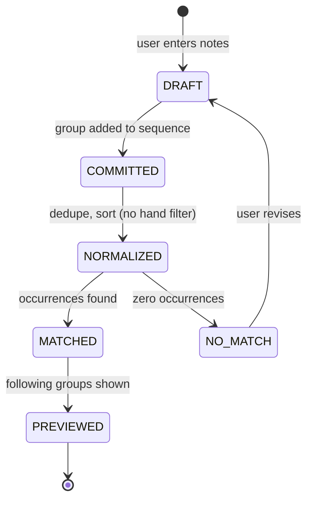
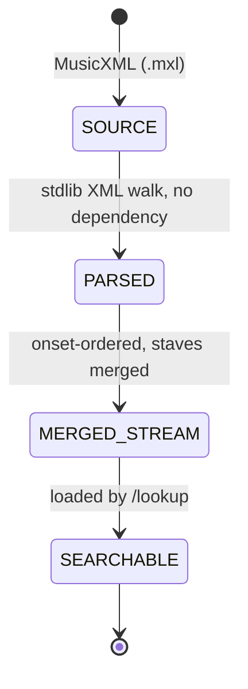
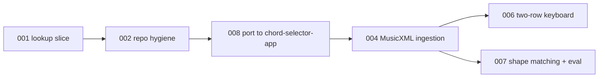

# Chordsense Product Loop Map

Status date: 2026-08-02
Depth: light and directional. This file is the navigational index. Deep, executable definitions live in `docs/planning/loops/`.

## Repository

**Home: `whoisbe/chord-selector-app`, branch `phrase-lookup`.** Vite 6 + React 18 + Radix + Tailwind + vitest.

Loops 001 and 002 were executed in `whoisbe/chordsense` — a different application (Next.js 15 App Router, MDX blog), cloned by mistake. Nothing was ever pushed there. Loop 008 ports the framework-independent work across; `chordsense` keeps its own life as a blog project.

The port cost almost nothing, for one reason: Loop 001's invariant that **search code has no React, DOM, network, or filesystem dependency** meant a whole framework change left the core logic untouched. The ADRs cost nothing either — they are facts about music data, not about a repo.

Loop IDs are assigned in creation order, not execution order. Execution order is the table below.

## Product frame

Chordsense answers one question: **"I'm at the piano, I remember this fragment, what comes next?"**

The user has a phrase in their hands or their head. They enter it. Chordsense finds every place that phrase occurs in a piece and shows what follows.

This is a reverse index over score data, not a practice app, notation editor, or playback engine.

## Two core objects, two lifecycles

The project has two objects with independent lifecycles. Loop 001 proved the first one against a fixture — and first contact with a real score then overturned part of it.

### Object A: Phrase query



Loop 001's transition: `DRAFT -> PREVIEWED` against a hand-authored fixture. Exact, ordered, register-sensitive, single-hand.

The `hand filter` step is struck through by ADR 0002. Input now arrives from two keyboard rows but produces one group per onset — see Loop 006.

### Object B: Piece

Both `UNKNOWN` nodes are now resolved — see ADR 0001.



The stream shape is the contract between the two objects. **Loop 001's version was wrong and is superseded by ADR 0002**, which replaced the staff-split, single-hand-filtered stream with a merged onset stream:

```ts
type NoteGroup = { measure: number; tick: number; notes: number[]; staves: number[] }
```

Staff survives as display metadata. It is not a search filter and is not called "hand." Store integer ticks, derive beats for display — triplets against `divisions=12` produce 1.33/1.67, and float beats invite equality bugs.

## Chunk sequence



| Loop | Type | Status | Gated on |
|---|---|---|---|
| [001 phrase lookup search vertical slice](loops/001-phrase-lookup-search-vertical-slice.md) | Completion | **DONE** | — |
| [002 repo hygiene and first commit](loops/002-repo-hygiene-and-first-commit.md) | Governance | **DONE** | — |
| ~~003 score data source decision~~ | Architecture-conformance | **superseded** — spike run inline, see ADR 0001 | — |
| [**008 port to chord-selector-app**](loops/008-port-to-chord-selector-app.md) | Completion | **engineered, NEXT — handed to Claude Code** | — |
| [004 MusicXML ingestion](loops/004-musicxml-ingestion.md) | Completion | engineered, **needs path/build revision after 008** | 008 |
| ~~005 Tailwind v3→v4 repair~~ | Repair | **dead** — defect was chordsense-only | — |
| [006 two-row virtual keyboard input](loops/006-two-row-keyboard-input.md) | Completion | engineered, **cheaper after 008** | 008, 004 |
| 007 shape matching and eval harness | Eval | directional | 004 |

### 001 phrase lookup search vertical slice — DONE

Executor: Codex. Evidence: `docs/sprints/output/phrase-lookup-search-vertical-slice-output.md`.

Codex passed every automated verifier and stranded at `BLOCKED` on one item: the prescribed `/lookup` browser interaction check, which its session had no browser backend to run. That was an executor-environment gap, not an implementation failure.

The macro layer closed it on 2026-08-01 against a human-hosted dev server: all six prescribed interaction steps passed, plus the empty-query message, no-results message, home-page link, and full C4–B5 button range. `npm test` and the search semantics were re-verified independently rather than accepted from the executor's self-report — including a fresh probe outside the loop's own test suite, which confirmed register sensitivity, exact group equality, real distractors in the fixture, and hand discrimination.

Two defects were found and deliberately **not** repaired, because both sit outside this loop's allowed paths:

- The ordered-query list renders doubled numbering, run together. Cosmetic; no acceptance criterion fails. Loop 005 replaces this input surface anyway, so the fix rides along there.
- **Tailwind utility classes are not applying anywhere in the app.** Verified on `/lookup` and on `/`, which predates Loop 001 — so this is a pre-existing repo condition, not something the slice introduced. Base styles from `globals.css` do apply. Currently unowned; see Open Decision 4.

### 002 repo hygiene and first commit — DONE

Loop 001 surfaced a defect it was forbidden from fixing. `.gitignore` line 21 carries `lib/` from a Python packaging template, so the entire Next.js `lib/` source tree is silently untracked, including all three `lib/music/` files Loop 001 was mandated to create. Verified with `git check-ignore -v`.

Nothing in the repo has been committed since Loop 001 ran. The slice exists only in the working tree.

The repo also still carried a Python-project identity: the root `README.md` documented a chord generator.

Executor: Codex. Terminal state `DONE`, zero repair attempts. Two commits: `71b2270` the Loop 001 slice, `4b273b3` the hygiene work.

Independently re-verified by the macro layer rather than accepted from the self-report: `lib/music/` is tracked and `git check-ignore` now exits 1 on it; `node_modules`, `.next`, and `.test-dist` remain ignored; `scripts/README.md` is byte-identical to the original root README, so it was moved rather than rewritten; `CLAUDE.md` and `AGENTS.md` are identical; `npm test` still 10/10. The defect was fixed at the rule, not papered over with `git add -f`.

### 003 score data source decision — SUPERSEDED

Specced as a three-way spike. Never run as a coding loop: the user supplied `data/spike/moonlight-sonata.mxl`, the macro layer parsed it inline, and one measurement collapsed the comparison — 1210 of 1210 notes carried an explicit `<staff>`, with zero heuristic inference. MIDI structurally cannot match that on the dimension that decides it. Recorded in **ADR 0001**.

Running the spike to confirm a foregone conclusion would have been ceremony. The spec file stays for the record, marked superseded.

### 004 MusicXML ingestion — engineered, next

Moves the real 69-measure movement from `.mxl` to the merged onset stream. The algorithm is already proven by the macro-layer spike, so the loop reimplements a known-good walk in TypeScript rather than discovering one, and the spike's numbers become the acceptance targets: 69 measures, 1169 pitched notes, 823 merged events, range F1–D#6.

Its decisive check is the founding query — `[F#3+F#4] → [C#4] → [E4]` must return exactly one match at measure 12 beat 4 — paired with a control proving each staff alone returns zero. A parser that gets the right answer for the wrong reason fails.

### 008 port to chord-selector-app — NEXT

Executor: Claude Code. The repo was cloned wrong; the intended home is `whoisbe/chord-selector-app`. Not a wrong clone of one project — a different application, so repointing the remote would not have worked.

Ports verbatim: the three pure `lib/music` modules (102 lines), all of `docs/`, both ADRs, the fixture, the `.mxl`. Converts the ten tests from `node:test` to vitest. Adds a deliberately throwaway smoke tab so the port is verifiable end to end. Discards `app/lookup/page.tsx` and `PhraseLookup.tsx`, which Loop 006 was replacing anyway.

Its governing constraint is **port faithfully, improve nothing in transit** — checks 7 and 8 diff every ported file against its original, which is what makes it a port rather than a rewrite. Check 13 re-verifies that `chordsense` is untouched and still `ahead 2`.

### ~~005 Tailwind v3→v4 repair~~ — DEAD

The v3 `@tailwind` directives against an installed v4 were a `chordsense` defect. `chord-selector-app`'s Tailwind works. Loop never runs.

### 006 two-row virtual keyboard input — engineered, and cheaper than specced

**`src/components/KeyboardDiagram.tsx` already exists in the destination repo** — 215 lines, MIDI-based at `startNote = 60`, the same `C4 = 60` convention we froze independently, with the exact white pattern `[0,2,4,5,7,9,11]` and black `[1,3,6,8,10]` the spec names, plus enharmonic labels and active-note highlighting.

It is display-only: `notes: number[]` in, render out, no click handling. So this loop becomes *extend an existing component* — add input, a second row, a wider range, continuation dimming — rather than build one. The spec should be revised against it after 008 lands.

Replaces both the Loop 001 button grid and the text-entry plan. Upper row is staff 1, lower row staff 2, geometrically identical and x-aligned so a pitch sits at the same position on both — non-negotiable, since the whole premise is spatial memory.

Both rows feed **one** group per onset, per ADR 0002. That is what lets the user enter the cross-staff F# octave at all.

The feature is corpus-constrained highlighting. Measured against the real movement:

| Prefix | Occurrences | Pitches that can follow |
|---|---|---|
| `[F#4]` | 77 | 20 of 55 |
| `[F#3 + F#4]` | 1 | **1 — C#4** |
| `[F#3+F#4] → [C#4]` | 1 | **1 — E4** |

After the octave, one key lights. Error prevention at entry rather than error forgiveness after the fact.

Geometry and continuations are pure modules with no React or DOM, so 9 of 15 verifier checks run without a browser — a direct consequence of the Loop 001 stranding.

### 007 shape matching and eval harness — directional

Kept directional on purpose; it should be specced from 004's evidence, not now.

Its case is already made. The user's remembered phrase was correct in shape but wrong by an octave, and shape matching — transposition-invariant on interval sequence — found the core arpeggio figure in 8 places when exact matching found 0. Shape matching is the primary retrieval mode, not a relaxation bolted on later.

Open axes to evaluate: interval-sequence invariance, subset matching for forgotten inner voices, gap tolerance, black/white contour, and **adjacent-physical-key** rather than ±1 semitone — because if input is spatial, the error model should be spatial. `E→F` is one semitone and adjacent; `C→D` is two semitones and adjacent.

The moment anything relaxes, results must be **ranked**, not just found. That is the real architectural change hiding in this loop.

## Open decisions

**~~OPEN DECISION 1~~ — RESOLVED: exact matching does not survive contact.**
Settled empirically, not by argument. The user's own remembered phrase returned **zero** exact matches against the real score, while shape matching returned the correct figure in 8 places. Loop 007 exists, it is an eval loop, and the eval must precede the fuzzy code.

**OPEN DECISION 2 — one piece or a corpus?**
Search across a library is a different product from search within a piece the user has already chosen. This changes the ranking problem, the UI, and whether an index is needed at all. Not yet answered. Does not block 002 or 003.

**~~OPEN DECISION 4~~ — RESOLVED: Loop 005 owns it.**
Cause diagnosed as a v3→v4 migration gap. Its own repair loop, kept out of Loop 002.

**OPEN DECISION 6 — does the Python chord generator have a home?**
`chordsense/scripts/` holds it, and `chord-selector-app/src/data/comprehensive_chords.csv` is its output — so the two repos were always related. Loop 008 does not port the generator. Whether it should move, stay, or become a third thing is unanswered and blocks nothing.

**OPEN DECISION 5 — is staff worth keeping at all?**
ADR 0002 demoted staff from search filter to display metadata. Whether it earns its place even there is untested: it may be useful for ranking ("this match is mostly in the upper staff") or it may be noise. Revisit after 006. Does not block anything.

**OPEN DECISION 3 — is there a server?**
Loop 001 forbade API routes, services, and persistence, and shipped a fully static build. Whether that survives 004 depends on corpus size. Not yet answered. Revisit after the ADR.

## Frozen contracts

These are settled and should not be relitigated without an ADR:

- MIDI integers internally, `C4 = 60`; sharp spelling in the UI.
- Search is pure TypeScript with no React, DOM, network, or filesystem dependency.
- A note group is a deduplicated, order-independent set at one onset. Groups match in order, contiguously, with exact group equality.
- Fixture data is labelled as fixture data and never asserted as score fact.
- No new package dependencies without an explicit decision.

## Methodology notes

Executor per loop is chosen at handoff time and recorded in the loop spec. Loop 001 ran on Codex; Loop 002 is assigned to Codex. Loops 004, 005, and 006 are engineered and unassigned.

Loop 001's `BLOCKED` outcome produced a durable learning worth carrying into every future handoff: **a verifier that requires a capability the executor's environment may not have is a verifier that can strand an otherwise complete loop.** Interaction checks should either be assigned to an executor with a confirmed browser, or be explicitly designated as human-verified steps in the handoff. Loop 002 Task 4 writes this into `CLAUDE.md` and `AGENTS.md`.

The resolution also demonstrated the escape hatch: the macro layer can close a stranded interaction check itself, given a human-hosted dev server. Codex was right to stop rather than substitute code inspection for a required check — that restraint is what made the amendment trustworthy.

A second discipline was worth the cost here: when the macro layer re-verified Loop 001, it wrote a **fresh** semantics probe rather than re-running the loop's own tests. Re-running an executor's tests confirms the tests, not the behaviour. The fresh probe is what surfaced that the fixture's distractors are real.

## The most expensive lesson so far

Recorded here because it changed a frozen contract within minutes of first real data, and it will recur.

**A fixture authored to satisfy a model cannot falsify that model.** Loop 001 shipped with 10 passing tests, a clean production build, and a full six-step interaction check — all against `data/pieces/phrase-lookup-demo.ts`, which was hand-written specifically to contain what the search was built to find. Every verifier was honest. None of them could have caught the defect.

The first real MusicXML file overturned the single-hand search contract in one query, because the user's actual phrase spans both staves and returns zero in either staff alone.

The practice that follows: **before freezing a contract, run a throwaway probe against real data, even one file.** It costs minutes. Loop 003 was specced as a full three-way coding loop and was answered by a fifty-line script the macro layer ran inline — which both settled ADR 0001 and, unplanned, produced ADR 0002.

Corollary for verifier design: 9 of Loop 006's 15 checks are pure-function checks that need no browser, because geometry and continuations were deliberately kept out of React. That structure is a direct consequence of Loop 001 stranding on a browser-only verifier.
